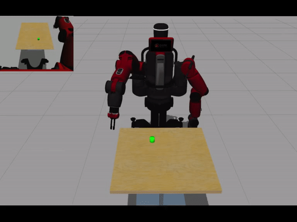

Training Baxter to grasp objects based on vision feedback and joint-torque control.

**Reinforcement Learning algorithm:** [Guided Policy Search](https://github.com/cbfinn/gps).

The environment is simulated using Gazebo/ROS Kinetic.

## Training session

## Learned policy

